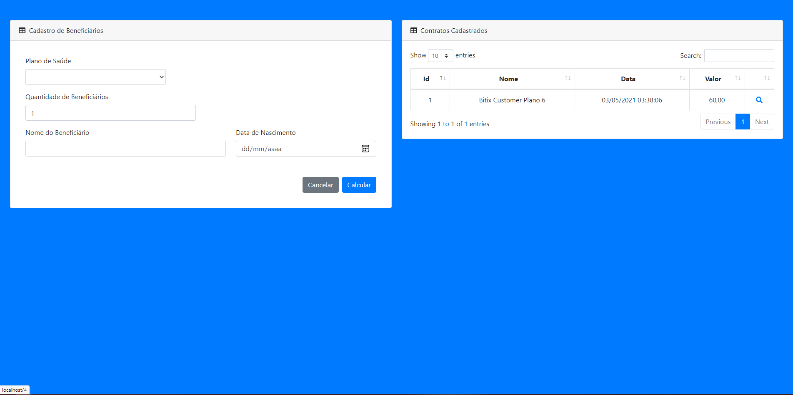

## Nome do Projeto 
<h1 align="center">Desafio PHP: Planos de Saúde</h1>

## Descrição do Projeto

Projeto desenvolvido para o Desafio em PHP: O sistema foi construido para cadastrar novos beneficiários em um determinado plano de saúde, respeitando as regras de faixa etára e quantidade de beneficiários cadastrados.

<h2>Tela inicial do projeto</h2>

No Fomulário a esquerda será inserido os dados do contrato, contendo o plano desejado, quantidade de beneficiários e o nome e idade dos respectivos beneficiários.

Na Tabela a direita informará os contratos já registrados na sessão.

<h2>Informações do Contrato</h2>

No formulário a esquerda estarão as informações do contrato solicitado, com as informações passadas no formulário anterior. Ao clicar em 'Contratar' estará registrando o contrato aceitando as respectivas informações.

<h2>Tabela dos Contratos Cadastrados</h2>

A tabela a direita mostrará os contratos cadastrados. Basta clicar na 'Lupa' para obter informaçoes do mesmo.

<h2></h2>

O formulário a direita mostrará informações detalhadas do contrato cadastrado.

